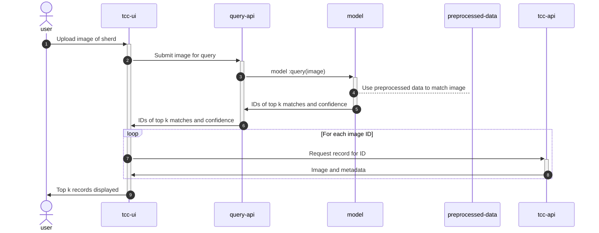
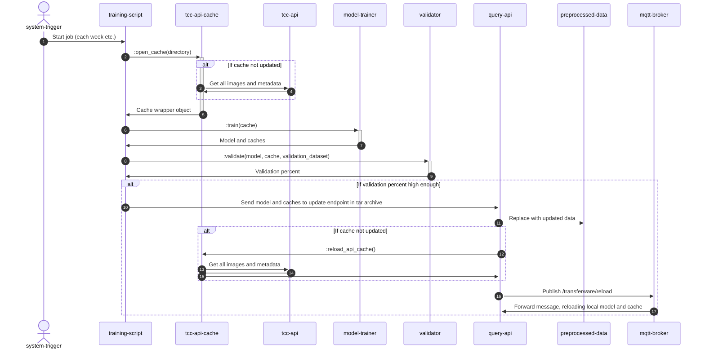
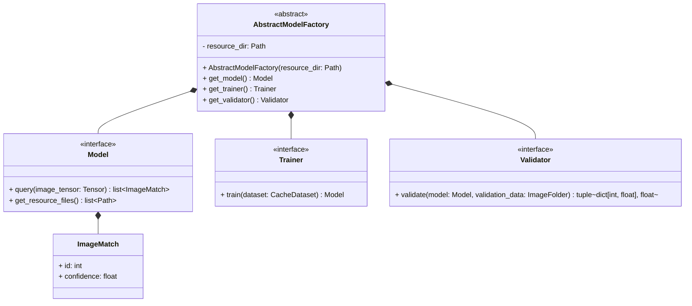
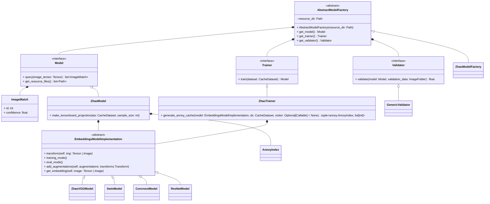
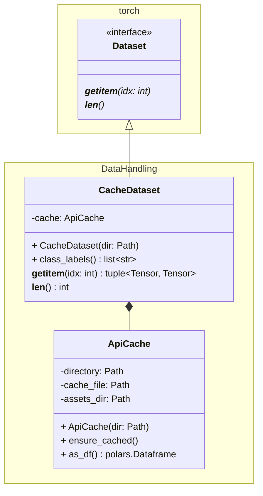

# System UML Diagrams

## Sequence

### Query image


### Update Model


## Communication

### Query image
````mermaid
stateDiagram-v2
    direction LR
    
    state tcc_api
    state query_api
    state model
    state preprocessed-data
    state tcc_ui
    state training_script 
    state tcc_api_cache
    state model-trainer
    state validator
    state user
    
    user-->tcc_ui: 1 Upload image of sherd
    tcc_ui-->query_api: 1.1 Submit image for query
    query_api-->model: 1.1.1 query(image)
    model-->preprocessed_data: 1.1.1.1 retrieve(dir)
    model--> query_api: 1.1.2 IDs of top k matches and confidence
    query_api-->tcc_ui: 1.2 IDs of top k matches and confidence
    
    tcc_ui-->tcc_api: 1.3 Request record for ID
    tcc_api-->tcc_ui: 1.4 Image and metadata
    
    tcc_ui-->user: 1.5 Tok k records displayed
````

### Update model
````mermaid
stateDiagram-v2
    direction LR
    
    state tcc_api
    state query_api
    state model
    state preprocessed_data
    state tcc_ui
    state training_script 
    state tcc_api_cache
    state model_trainer
    state validator
    state system_trigger
    
    system_trigger-->training_script: 1 Start job
    training_script-->tcc_api_cache: 1.1 open_cache(directory)
    tcc_api_cache-->tcc_api: 1.1.1 Get all images and metadata
    tcc_api-->tcc_api_cache: 1.1.2 Images and metadata
    tcc_api_cache-->training_script: 1.2 Cache wrapper object
    training_script-->model_trainer: 1.3 train(cache)
    model_trainer-->training_script: 1.4 Model and caches
    training_script-->validator: 1.5 validator(model, cache, validation_dataset)
    validator-->training_script: 1.6 Validation percent
    training_script-->query_api: 1.7 Send model and caches to update endpoint
    query_api-->preprocessed_data: 1.7.1 Replace with updated data 
    query_api-->model: 1.7.2 reload()
````

# Classes

## Model


An abstract factory is used to create working combinations of pipelines. The Model is either loaded from resources on
disk, or created by the Trainer. The validator takes the model and does black box validation by checking if validation
images (from Wayne state) are in the top 10 query results. So this validation is not for whatever the trainer does, 
but for the system as a whole.

The end application should load a specific factory based off configurations, so ideally all model information will be
encapsulated within these three classes. This should make it trivial to then swap in something like SIFT matching 
instead of a deep learning approach, while still allowing enough complexity for embedding approaches.

## Embeddings model


The embeddings approach uses a bridge to decouple the low level torch implementations that create the embeddings
themselves from the high level embeddings search logic. This allows us to easily experiment with different underlying
NN architectures without needing to change the rest of the code. This is not really for runtime behavior, just
structure.
## Dataset


The dataset is backed by a wrapper over the API cache, where the API cache is represented as a dataframe.
This setup allows for us to easily make drastic changes in class choice, as we don't need to change a directory layout,
just change some dataframe queries. Get item is returning image, class_id pairs.
